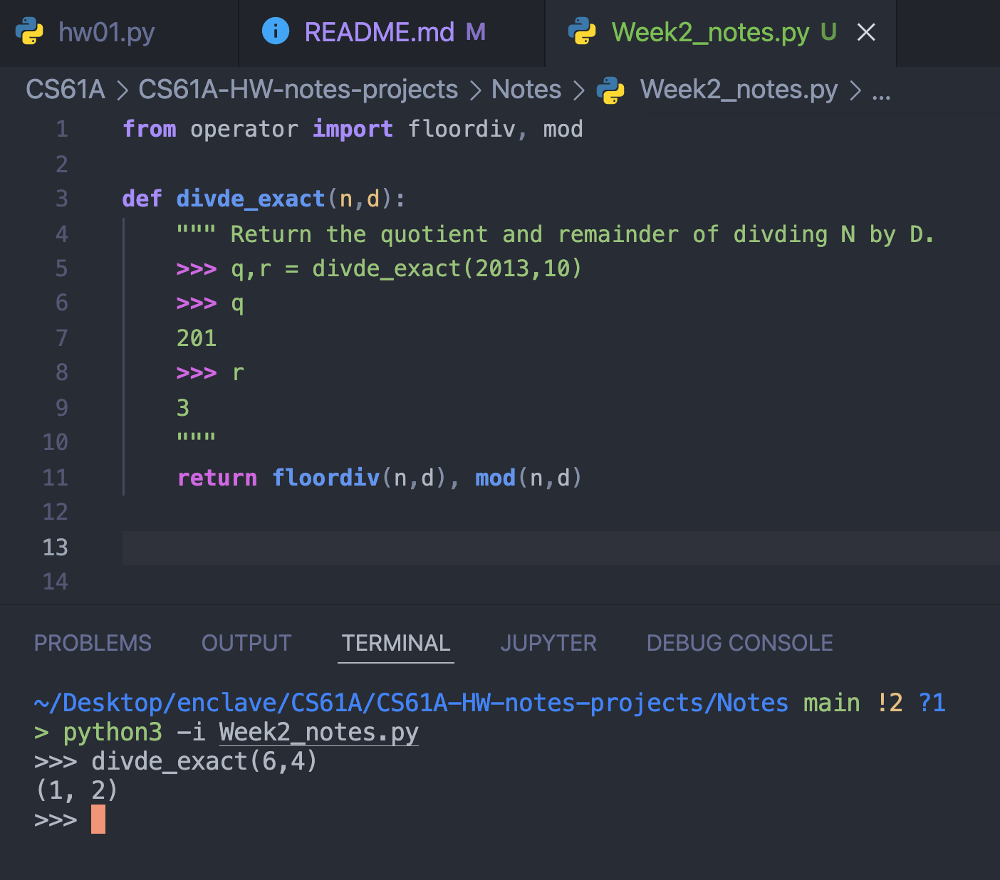
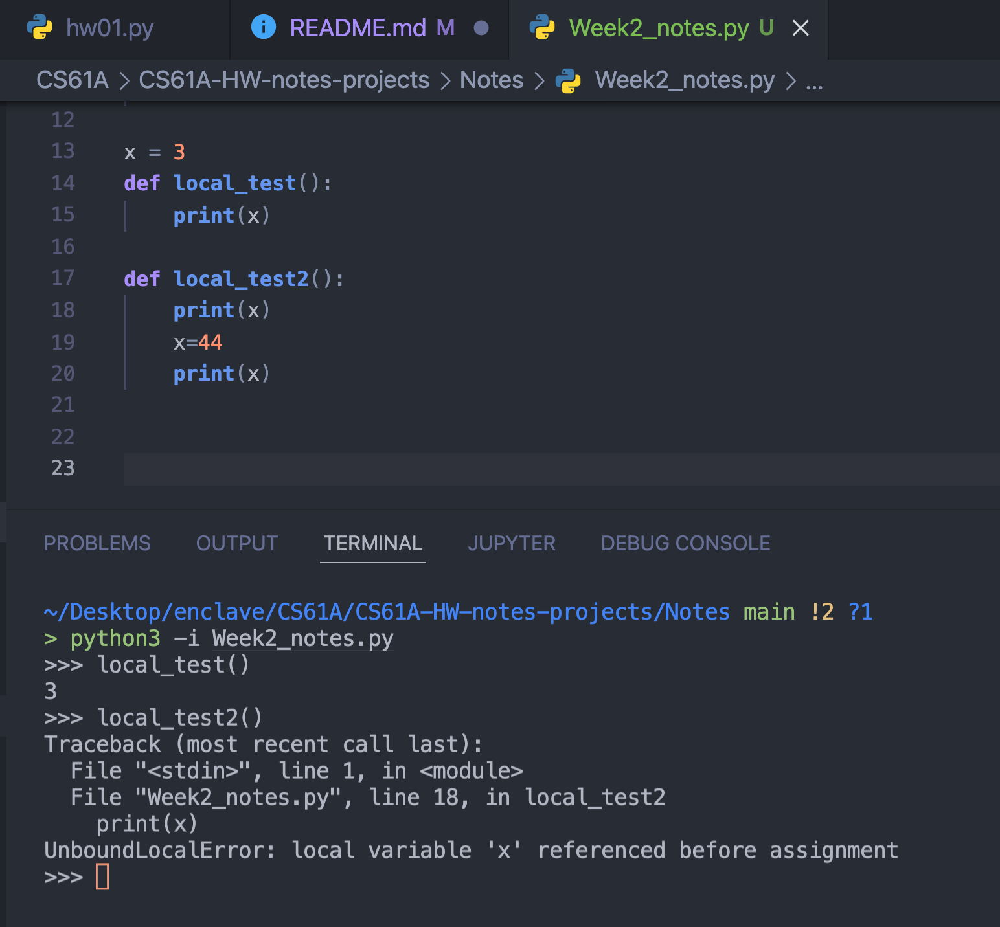
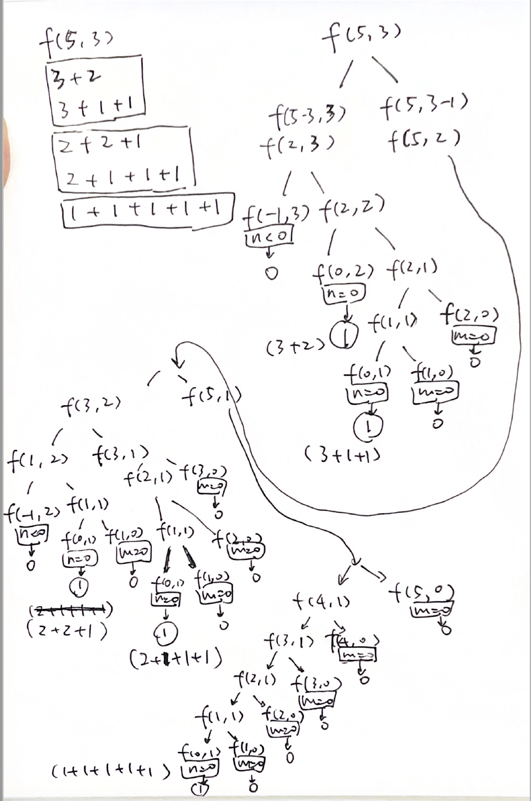

# CS61A-HW-notes-projects

## Notes
#### python interactive mode 
`$ python3 -i XXX.py`    
> -i:    
> inspect interactively after running script; forces a prompt even if stdin does not appear to be a terminal;
> 
          
<br>

#### test domo               
`$ python3 -m doctest -v XXX.py`
> -m doctest -v
> simulate session, demo the example in function's doc. Invoke the doc test module on a particular `.py` file.       

<br>

#### local variable 'x' referenced before assignment      
you can't have the same local and a global name at the same time, in a function


<br>     

#### lambda
lambda: a function with formal parameter x (or anything else)
```python
>>> squr = lambda x: x*x
>>> squr(4)
16

>>> lambda x: x*3
<function <lambda> at 0x7fa7600d4280>

>>> (lambda x: x*3)(3)
9
```

<br>

#### `/` and `//`
```python
pi = 31415926535897932384626433832795028841971693993751058209749445923078164062862089986280348253421170679

>>> str(pi)[0:43]
'3141592653589793238462643383279502884197169'
>>> str(int(pi//pow(10,100-42)))
'3141592653589793238462643383279502884197169'
>>> str(int(pi/pow(10,100-42)))
'3141592653589793295822723802173786288029696'
```

<br>

#### Question 6 Suite 2 Case 4
```python
> python3 -i hog.py
>>> def total(s0,s1):
...     print(s0+s1)
...     return echo
... 
>>> def echo(s0,s1):
...     print(s0,s1)
...     return total
... 
>>> s0, s1 = play(always_roll(1), always_roll(1), dice=make_test_dice(2, 5), goal=10, say=echo)
who: 0
whether scores are smaller than goal: True
add 2 to score0
2 0
score0: 2, score1: 0
change player to 1
add 5 to score1
7
score0: 2, score1: 5
change player to 0
who: 0
whether scores are smaller than goal: True
add 2 to score0
4 5
score0: 4, score1: 5
there is an extra_turn, continue
who: 0
whether scores are smaller than goal: True
add 5 to score0
14
score0: 9, score1: 5
change player to 1
add 2 to score1
9 7
score0: 9, score1: 7
there is an extra_turn, continue
who: 1
whether scores are smaller than goal: True
add 5 to score1
21
score0: 9, score1: 12
whether scores are smaller than goal: False
```

<br>

#### `*arg`
```python
def a(*args):
    print(type(args))
    print(args)
    print(*args)
    for i in args:
        print(i)

"""
*args take para as tuple
>>> a(1,2,3)
<class 'tuple'>
(1, 2, 3) # print((1,2,3))
1 2 3  # it's like print(1,2,3)
1
2
3
"""
```

<br>

#### count partitions
[this vedio](https://www.youtube.com/watch?v=DvgT4dnSMVM&list=PL6BsET-8jgYU1eWkdF45L1Pce1d4DxJcR&index=7)
```python
# count partitions
# count_partitions(5,3)
# 3+2
# 3+1+1
# 2+2+1
# 2+1+1+1
# 1+1+1+1+1
def count_partitions(n,m):
    # return how many ways to make the equation, e.g. there are 5 for f(5,3)
    if n==0:
        return 1
    elif n<0:
        return 0
    elif m==0:
        return 0
    else:
        with_m = count_partitions(n-m,m)
        without_m = count_partitions(n,m-1)
        return with_m + without_m
```
...just draw it on a paper


<br>

#### mutation object
```python
def f(s=[]):
    s.append(3)
    return len(s)

f()
> 1
f()
> 2
f()
> 3

def f():
    s = []
    s.append(3)
    return s

f()
> [3]
f()
> [3]
f()
> [3]

```

<br>

### Identity and equality
**Identity:**    
evaluates to `True` if both a and b evaluates to **_the same object_**

when two things are identical, changes to one will affect the other.
if you change the value of a, b would also be changed. 

**Equality**   
evaluates to `True` if a and b **_have equal values_**

```python
[1] == [1]
> True

[1] is [1]
> False

a = [1]
b = a
a is b # identity
> True
a == b # equality
> True

```

<br>

### nonlocal statement
`nonlocal XXXvar`
future assignments to that name change its pre-existing binding in the first non-local frame (enclosing scope) of the current environment in which that name is bound.
```python
def make_withdraw(balance):
    def withdraw(amount):
        nonlocal balance
        # if we remove the line above
        # python would assume balance is a local name,
        # it would only look for balance in def withdraw
        # so got error: local variable "balance" referenced before assignment
        print(f"amount: {amount}, balance: {balance}")

        if amount > balance:
            return "insufficient funds"
        balance = balance-amount
        # there won't be error message if we remove the line above
        # no assignment would be made to balance, it won't change
        
        # if we replace it into "return balance-amount", and remove the nonlocal statement
        # it would be ok to run without error, but value of balance won't change each time the withdraw() is called
        
        print(f"after minus: amount: {amount}, balance: {balance}")

        return balance
    return withdraw
```

